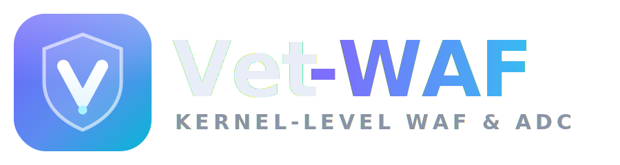

# Vet-WAF

**Website:** https://hoangtuvungcao.github.io/vet-waf/ ·
**Source:** https://github.com/hoangtuvungcao/vet-waf

## What it is?

**Vet-WAF** is an all-in-one open-source solution for high performance web
content delivery and advanced protection against DDoS and web attacks. This is a
drop-in-replacement for the whole web server frontend infrastructure: an HTTPS
load balancer, a web accelerator, a DDoS mitigation system, and a web application
firewall (WAF).

**Vet-WAF** is the first and only hybrid of a Web accelerator and a multi-layer
firewall. This unique architecture provides
[seamless integration](https://github.com/hoangtuvungcao/vet-waf/wiki/HTTP-tables)
with the Linux iptables or nftables.

**Vet-WAF** services up to 1.8M HTTP requests per second on the cheapest hardware,
which is x3 faster than Nginx or HAProxy. **Vet-WAF TLS** is about
[40-80% faster than Nginx/OpenSSL and provides up to x4 lower latency](https://netdevconf.info/0x14/session.html?talk-performance-study-of-kernel-TLS-handshakes).

## How it works?

**Vet-WAF** is built into Linux TCP/IP stack for better and more stable
performance characteristics in comparison with TCP servers on top of common
Socket API or even DPDK or other kernel bypass technology.

We do our best to keep the kernel modifications as small as possible. The current
[patch](https://github.com/hoangtuvungcao/vet-waf/blob/master/linux-6.12.12.patch)
is just a few thousand lines.

## Current state

We're in [Beta](https://en.wikipedia.org/wiki/Software_release_life_cycle#Beta)
state for now. The beta is available by:

* [source code](https://github.com/hoangtuvungcao/vet-waf/wiki/Install-from-Sources)
* [installation script](https://github.com/hoangtuvungcao/vet-waf/wiki/Install-from-packages) (binary packages)

The **master** branch is a development (and unstable) branch for contributers and
early testers only.

## Installation and Configuration

Please see our **[Wiki](https://github.com/hoangtuvungcao/vet-waf/wiki)** for
following topics:

* [Quick start](https://github.com/hoangtuvungcao/vet-waf/wiki/Configuration#quick-start)
* [Design description](https://github.com/hoangtuvungcao/vet-waf/wiki/Home#design-considerations)
* [System requirements](https://github.com/hoangtuvungcao/vet-waf/wiki/Requirements)
* [Installation procedures](https://github.com/hoangtuvungcao/vet-waf/wiki/Installation)
* [Configuration guide](https://github.com/hoangtuvungcao/vet-waf/wiki/Configuration)
* [Use cases](https://github.com/hoangtuvungcao/vet-waf/wiki/Use-cases)
* [Performance tips & benchmarks](https://github.com/hoangtuvungcao/vet-waf/wiki/Performance)
* [High availability](https://github.com/hoangtuvungcao/vet-waf/wiki/High-availability)
* [Observability](https://github.com/hoangtuvungcao/vet-waf/wiki/Access-Log-Analytics)
* [Application performance monitoring](https://github.com/hoangtuvungcao/vet-waf/wiki/Application-Performance-Monitoring)

## Contribute to Vet-WAF

Please follow [Vet-WAF Contributor's Guide](https://github.com/hoangtuvungcao/vet-waf/wiki/Development-guidelines)
for guidance on making new contributions to the repository.

## License

The Vet-WAF engine is licensed under **GPLv2** — see [LICENSE](LICENSE). It is
derived from [Tempesta FW](https://github.com/tempesta-tech/tempesta), which is
also GPLv2; the copyleft terms carry over to this fork.

The website and brand assets under `docs/` are additionally available under the
MIT license — see [MIT.md](MIT.md).
